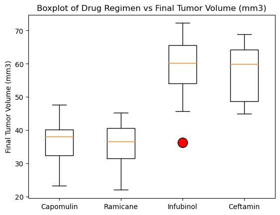
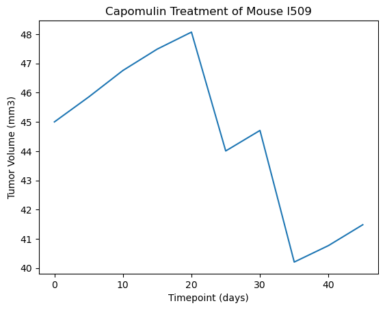

## Module 5 Challenge, 20 July 2023, matplotlib Challenge

Development on this project has stopped.

## Description

The Jupyter Notebook in Pymaceuticals/pymaceuticals.ipynb analyzes the results of a screening for potential treatments for squamous cell carcinoma (SCC), a commonly occurring form of skin cancer, on a population of 249 mice over a 45-day period.

It produces a number of useful tables and figures to display the results.

A written analysis summarizes the results at the top.

## Usage

You can view the results in Pymaceuticals/pymaceuticals.ipynb. If you want to run the code, restart the kernel and 'run all'.

## Gallery of Significant Results:

Drug Effectiveness:

Example results for a single mouse:

## Acknowledgments

Thanks to Geronimo Perez for feedback and assistance

## Author

Bryan Johns, July, 2023
